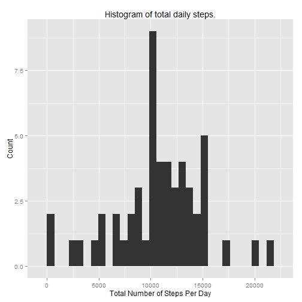
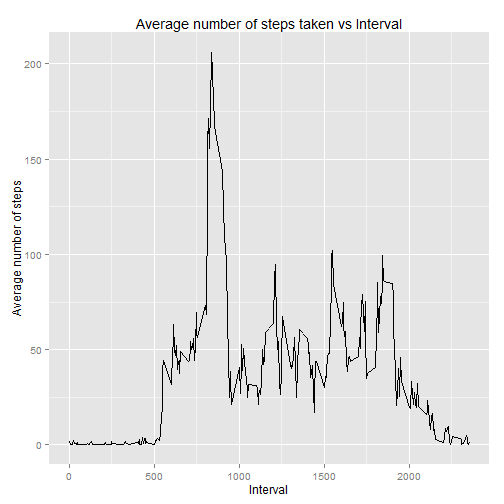
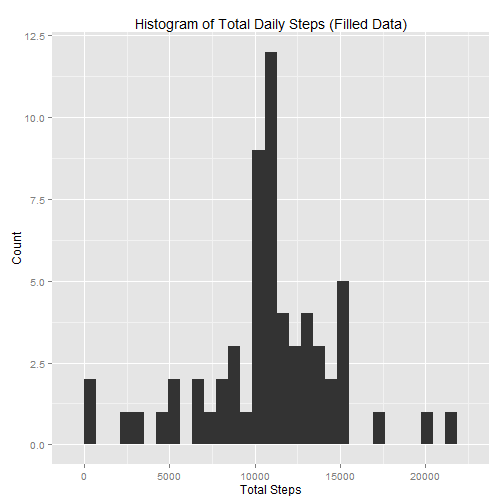
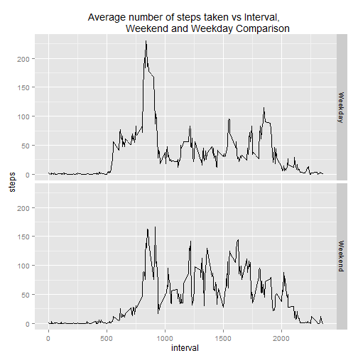

Reproducible Data - Peer Assessment 1
=====================================

---


##Introduction

Taken from the Peer Assessments's [Github Page](https://github.com/rdpeng/RepData_PeerAssessment1): 

It is now possible to collect a large amount of data about personal movement using activity monitoring devices such as a Fitbit, Nike Fuelband, or Jawbone Up. These type of devices are part of the "quantified self" movement -- a group of enthusiasts who take measurements about themselves regularly to improve their health, to find patterns in their behavior, or because they are tech geeks. But these data remain under-utilized both because the raw data are hard to obtain and there is a lack of statistical methods and software for processing and interpreting the data.

This assignment makes use of data from a personal activity monitoring device. This device collects data at 5 minute intervals through out the day. The data consists of two months of data from an anonymous individual collected during the months of October and November, 2012 and include the number of steps taken in 5 minute intervals each day.

##What is the mean total number of steps taken per day?

We address this question by plotting a histogram of the total number of steps that are taken each day.


```r
##Code required dplyr for dataframe manipulation and ggplot2 for plotting 
suppressMessages(library(dplyr));
suppressWarnings(library(ggplot2));

##Finds the total number of steps taken per day. Requires activity.csv to be in working directory
activityData<-read.csv("activity.csv")
noNAData<-activityData[complete.cases(activityData$steps),]
byDate<-group_by(noNAData, date)
totalStepsPerDay <- summarize(byDate, sum(steps))
colnames(totalStepsPerDay)[2] <- "steps"

#Creates a histogram plot

qplot(totalStepsPerDay$steps, 
      xlab = "Total Number of Steps Per Day",
      ylab = "Count")+
        ggtitle("Histogram of total daily steps.")
```

```
## stat_bin: binwidth defaulted to range/30. Use 'binwidth = x' to adjust this.
```

 

We can see from the histogram that the total number of steps are centred around 10,000 steps or so. The precise mean/median is summarized by the table below, confirming which confirms this:


```r
summary(totalStepsPerDay$steps)
```

```
##    Min. 1st Qu.  Median    Mean 3rd Qu.    Max. 
##      41    8841   10760   10770   13290   21190
```


##What is the average daily activity pattern?

We address this question by making a time series plot of the average daily activity patterns (that is, we plot the activity averaged over all days).


```r
##calculates the average daily activity
byInterval<-group_by(noNAData, interval)
averageDaily<-summarize(byInterval,mean(steps))
colnames(averageDaily)[2]<-"steps"


##plots time series activity data
qplot(averageDaily$interval, averageDaily$steps, 
      geom = "line",
      xlab = "Interval",
      ylab = "Average number of steps")+
        ggtitle("Average number of steps taken vs Interval")
```

 

```r
##finds the interval with highest activity
maxIndex <- which.max(averageDaily$steps)
maxInterval <- averageDaily$interval[maxIndex]
```

The max number of steps (on average) occurs in the interval 835 (that is, between 8.35 am and 8.40am when many people are heading for work).  From the histogram, average activiy is the lowest before 5am, when most people are sleeping. Average activity also drops sharply after 8pm, when most people have likely finished work.

##Inputing missing values

There are NA values in the raw data. Some days are left out in the histogram plot. To fill in this gap we will them with the mean interval values. The resulting filled data set is not going to affect the averages, and will give a rough approximate of the total counts *if* those days correctly recorded data. 


The number of observations with NAs is 2304 out of 17568 observations. This may be signigicant

The code filling the data is below:


```r
##replaces all NAs for a given interval with the mean value for that interval
lookupMeanSteps <- function(meanSteps, interval){
        meanSteps[meanSteps$interval==as.numeric(interval),2]
}

filledSteps <- apply(activityData, MARGIN=1, 
                    function(row){
                            if(is.na(row[1])){
                                    row[1]<-lookupMeanSteps(averageDaily, row[3])
                            }
                            as.numeric(row[1])
                    }
                    )
filledData<-activityData
filledData$steps <- filledSteps
```

Using this filled data, we recalculate the total number of steps in any given day:


```r
##recalculates the total number of steps in a day
byDateFilledData <- group_by(filledData, date)
totalStepsFilledData <- summarize(byDateFilledData, sum(steps))
colnames(totalStepsFilledData)[2] <- "steps"

##Plots histogram of the total daily steps
qplot(totalStepsFilledData$steps, 
      xlab = "Total Steps",
      ylab = "Count") +
        ggtitle("Histogram of Total Daily Steps (Filled Data)")
```

```
## stat_bin: binwidth defaulted to range/30. Use 'binwidth = x' to adjust this.
```

 

```r
summary(totalStepsFilledData$steps)
```

```
##    Min. 1st Qu.  Median    Mean 3rd Qu.    Max. 
##      41    9819   10770   10770   12810   21190
```

As expected filling in the missing values increased the the number of counts at the mean value of the histogram, representing days with missing data. The mean values remain unchanged as can be seen from the above data summary. This is by design since the filled in data are the mean values for each interval. The median count rate did get shifted slightly using the filled data, but not signigicantly. 


##Are there differences in activity patterns between weekdays and weekends?
Given that the activity levels are presumable indicated by sleep and work patterns of an average individual, there is likely to be a difference between weekend and weekday activity levels. We address this by plotting seperately the weekday and weekend data:


```r
##finds out which of the days are weekdays, and which are weekends
filledData$date <-as.Date(as.character(filledData$date), "%Y-%m-%d")
isWeekend<-(as.character(weekdays(filledData$date, abbreviate = TRUE))  == "Sun"|
                as.character(weekdays(filledData$date, abbreviate = TRUE))  == "Sat")

        
##separates the weekend and weekday data, calculates the daily mean activities of each
weekendData <- filledData[isWeekend,]
weekdayData <- filledData[!isWeekend,]
byIntervalWeekend <- group_by(weekendData, interval)
byIntervalWeekday <- group_by(weekdayData, interval)
meanWeekendInterval <- summarize(byIntervalWeekend, mean(steps))
meanWeekdayInterval <- summarize(byIntervalWeekday, mean(steps))
meanWeekendInterval$isWeekend <- rep("Weekend", times = length(sum(isWeekend)))
meanWeekdayInterval$isWeekend <- rep("Weekday", times = length(sum(!isWeekend)))

##combines both datasets into kone dataframe 
meanDailyInterval <- rbind(meanWeekendInterval,meanWeekdayInterval)
colnames(meanDailyInterval)[2] <- "steps"

##plots daily activity, separated by weekday and weekend
qplot(interval, 
      steps, 
      data = meanDailyInterval, 
      facets = isWeekend ~ ., 
      geom = "line") +
        ggtitle("Average number of steps taken vs Interval, 
                Weekend and Weekday Comparison")
```

 


From both plots, we can see that activity rises later on the Weekend later as compared to the Weekday data. It also drops later on in the day. The peak activity on weekends is also lower. This suggests that during the weekdays, the subjects sleep in later and also goes to bed later in the day. The peak activity is also lower, suggesting many people rest during the weekends. This affirms the assertion that activity levels are highly affected by the work and sleep schedules of the subjects. 
